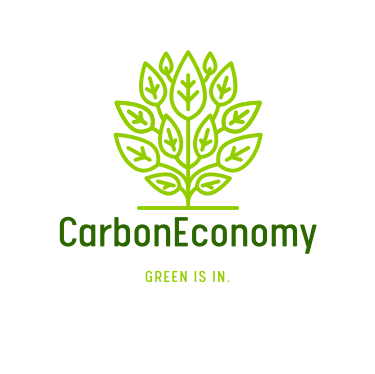

    

***Welcome to CarbonEconomy.***

This is a monorepo that contains the following applications:
1. **Green Pouch**: a mobile application for users to manage their GreenCredits, Rewards Redemption and be habituated to green consumerist behaviours

    
2. **Green API**: 
     - a _fair and open_ Carbon Footprint Estimation API
     - GreenCredits issuance API for businesses to use.
   
  
3. [**demo-app**](https://staging.d2b5azad2jt53v.amplifyapp.com/): A demo application that provides a Proof of Concept on how participating businesses may utilise GreenAPI to estimate and issue Green Credits.  
   Friendly link: [tinyurl.com/CarbonEconomyDemoApp](https://tinyurl.com/CarbonEconomyDemoApp)  
   
   
4. [**GreenMap**](https://main.d2vpuz7o81axh0.amplifyapp.com/): A self-exploratory visualisation website that uses data collected from GreenAPI use and encourages participation in the CarbonEconomy.   
   Friendly link: [tinyurl.com/CarbonEconomyGreenMap](https://tinyurl.com/CarbonEconomyGreenMap)

[Here's](resources/Proposal_Challenge_10_Team_CarbonEconomy.pdf) the proposal for the vision behind this project.
